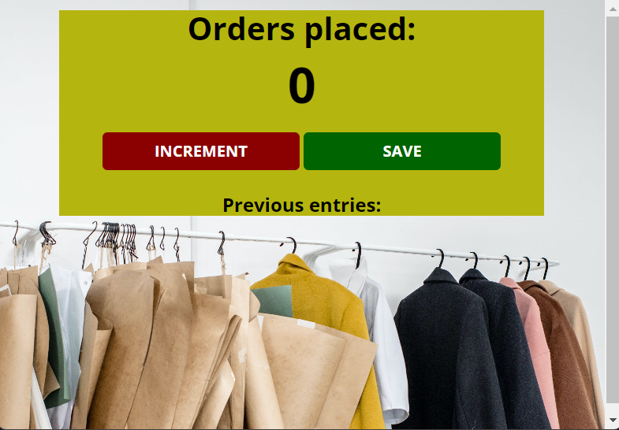

# Order Counter App

## Description
This app counts the total number of orders received and saves it.

## Features
### Order Counter

Track and manage the number of orders placed at the store.

### Real-time Updates 

Updates the count in real-time, providing accurate information.

### Simple and Intuitive

User-friendly interface for easy interaction.

## Screenshots

## Clone the repository
git clone https://github.com/nonsoiwedinobi/Order-Counter

### Contributing
If you'd like contributions from the community, provide guidelines for how others can contribute to your project.

### License
Specify the license under which your web app is released.

### Contact
Email: nonsoiwedinobi@gmail.com

